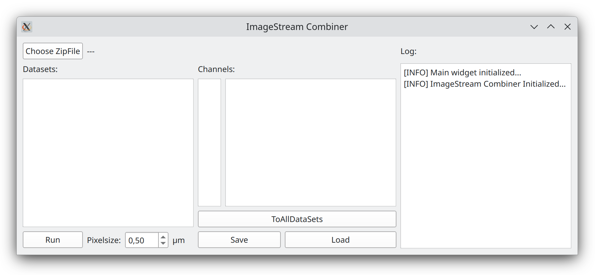
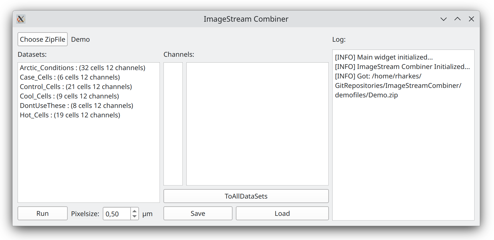
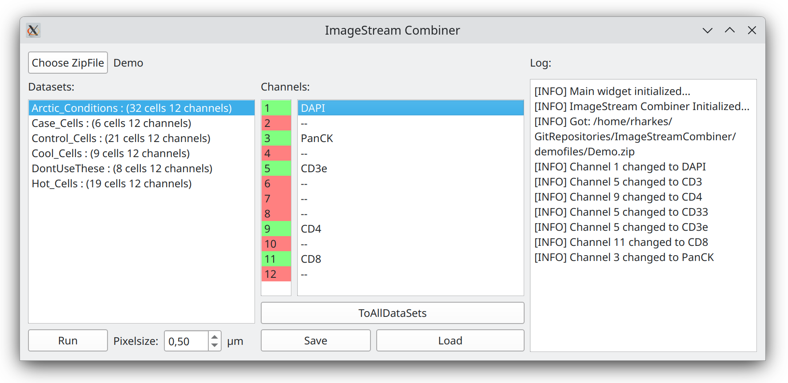

# Combine ImageStream Files
Software to combine many small .tiff files from the [ImageStream](https://cytekbio.com/pages/imagestream) into a single .tiff for analysis in [FIJI](https://fiji.sc/). For further analysis of ImageStream images, see our [ImageStreamAnalysis](https://github.com/BioImaging-NKI/ImageStreamAnalysis) repository.
## Installation
### With user interface
* Download from [release](https://github.com/BioImaging-NKI/ImageStreamCombiner/releases)

or

* Install: `pip install .[gui]`
* [Generate ui](/ui)
* Run: `python ImageStreamCombiner.py`

### Commandline interface
* Clone or download the repository
* `pip install .`
* `combine_imagestream_files -h`

## Usage with user interface
When starting the executable you should see this startscreen:

First choose a zip-file, or drop one on the window. ([example](demofiles/Demo.zip)) The datasets in the zip will be recognised and the number of cells and channels is displayed:

Set the channel names of the channels that need to be exported. This can be done either by:
* Typing in the list
* Loading a .toml file ([example](demofiles/Arctic_Conditions.toml)). A .toml file can also be dropped on the window.

When thechannel names are set, they can also be saved to a .toml file. If all datasets have the same channel names the button "ToAllDatasets" copies the current channel names to all datasets.

Make sure to set the correct pixelsize. Press Run and the .tif files will appear in the same folder as the .zip file.

## Usage without user interface
Run this command and all will be explained.

`combine_imagestream_files --help`

It expects a .zip file with the small tiff files in a seperate folder for each dataset. (see also [usage with user interface](#usage-with-user-interface)) 

## Contributing
### Building standalone executable
* `pip install .[build]`
* [Generate ui](/ui)
* `pyi-makespec ImageStreamCombiner.py`
* `pyinstaller ImageStreamCombiner.spec`

### Editable install
* `pip install meson-python meson ninja`
* `pip install --no-build-isolation --editable .[dev]`
